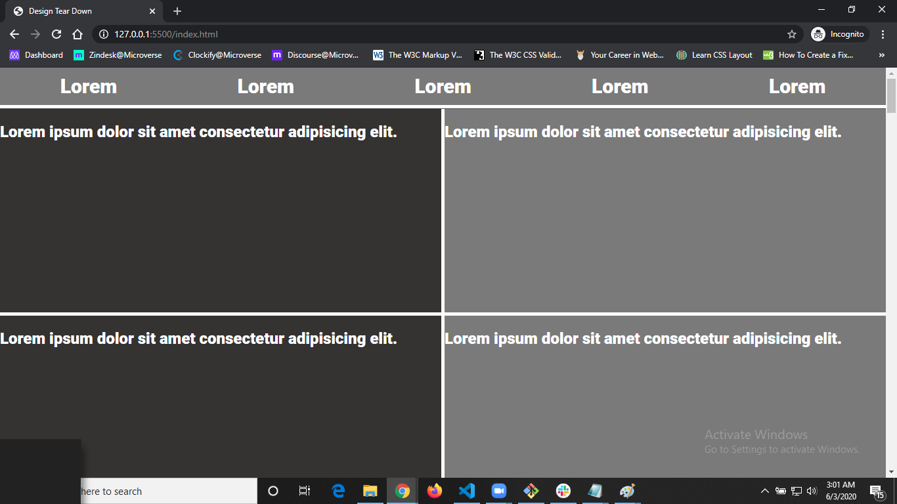

# Project Name

> Design Tear Down (Smashing Magzine website).

This project design is inspired by Samashing Magazine website.
It's a simple website which shows the importance of visual hierarchy.
We designed three hierarchies; low, medium and high.
This website is designed with pure css.

## Built With

- Html and CSS,

## Live Demo

[Live Demo Link](https://rawcdn.githack.com/SajjadAhmad14/Smashing-Magazine/74b130d638eba097a2f3a6a74f3aea2fb03dff65/index.html)

## How to clone and use this project?
1: Just go the https://github.com/SajjadAhmad14/Smashing-Magazine
2: Get index.html file or clone the whole project.
3: Feel free to add changes.

## Authors

👤 **Sajjad Ahmad**

- Github: [@githubhandle](https://github.com/SajjadAhmad14)
- Twitter: [@twitterhandle](https://twitter.com/Sajjad_Ahmad14)
- Linkedin: [linkedin](https://www.linkedin.com/in/sajjad-ahmad-86102117a/)

👤 **Kelyn Njeri**

- Github: [@githubhandle](https://github.com/KelynPNjeri)
- Twitter: [@twitterhandle](https://twitter.com/KelynNjeri)
- Linkedin: [linkedin](https://www.linkedin.com/in/kelyn-paul)

## 🤝 Contributing

Contributions, issues and feature requests are welcome!

Feel free to check the [issues page](https://github.com/SajjadAhmad14/Smashing-Magazine/issues).

## Show your support

Give a ⭐️ if you like this project!

## Acknowledgments

- Hat tip to anyone whose code was used
- Inspiration
- etc
